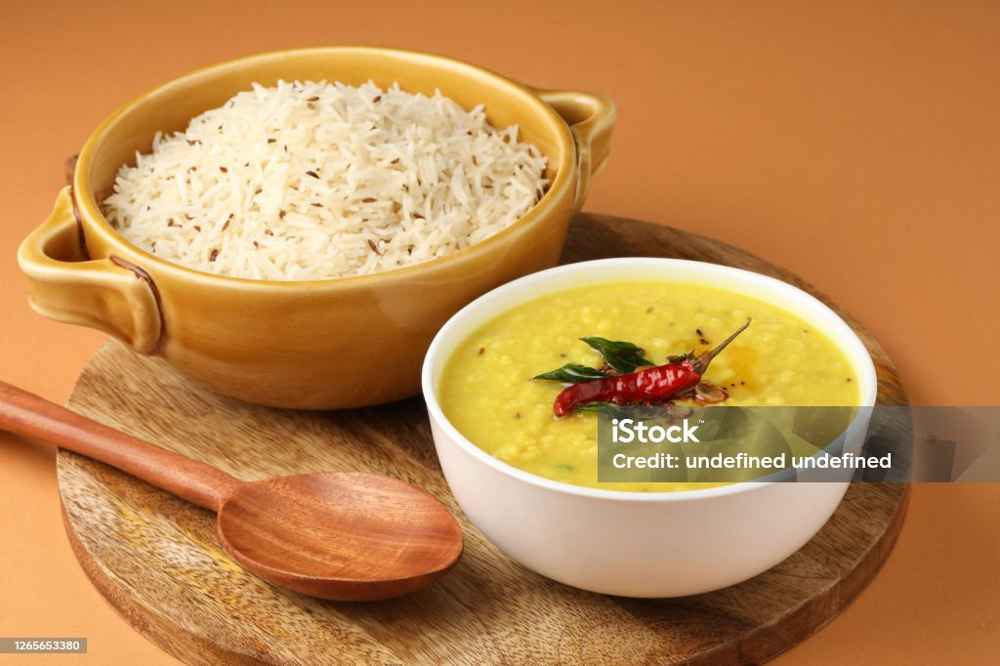

<!DOCTYPE html>
<html lang="en">
<head>
   <b> Jeera-Rice Daal-Fry</b>
</head>
<body>
    
    <b> Ingredians for jeera-rice:- </b>
    --> 100gm rice 
    --> 5 t-spn ghee 
    --> 2 t-spn jeera 
    --> 1 t-spn oil
    --> 1 t-spn salt
    --> 2-cup water
    
   <b> Ingredians for daal-fry:- </b>
    -->Veggies
    -->Green Chilies
    -->Curry Leaves
    -->Hing Powder
    -->Coriander leaves
    -->Kasuri Methi
    -->Additional Seasonings
    
   <b>Jeera-Rice Making</b>
       
                step-1:: Take 100gm of rice and wash it with clean water. Take a pan and put 2-cups of water. Add washed rice, 1 t-spn oil, 1  t-spn salt into the pan on low flame for 30 mins.  
                step-2:: Now take a pan and add 2 t-spn of ghee and add 2 t-spn jeera. Add cooked rice into pan. Mix properly and your tasty jeera-rice is ready to serve.
       
   <b>Daal-Fry Making</b>
       
            <b>Cook Dal</b> 
                
               1. Rinse your lentils in water for 3 to 4 times. I would recommend using ½ cup tuvar dal (arhar dal or pigeon pea lentils) or ¼ cup each of tuvar dal and masoor dal (pink or orange lentils).
               2. After rinsing, pour the lentils into a 2-liter pressure cooker and toss in a pinch of turmeric powder and 1.5 cups of water.
               3. Pressure cook the lentils for 9 to 10 minutes on medium heat, or until they are thoroughly cooked and completely soft. Once lentils are cooked, mash them with a spoon or wired whisk, then set aside.
          
            <b>Sauté Onions, Tomatoes, Spices</b>
               
               4. Heat 2 to 3 tablespoons of oil, ghee or unsalted butter in a pan or skillet. Once hot, add ½ or ¾ teaspoon of black mustard seeds.
               5. When you hear the mustard seeds start crackling, add 1 teaspoon of cumin seeds and fry them with the mustard seeds for several seconds or until they change color. You should hear the same crackle for the cumin seeds!
               6. With the mustard and cumin seeds still in the pan, add ⅓ cup of chopped onions.
               7. Sauté the seeds and onion mixture until the onions become translucent or lightly browned.
               8. When the onions have lightly browned, add in 1 to 1.5 teaspoons ginger-garlic paste and stir to combine. Sauté the mixture for a few seconds or until the raw aroma of the ginger-garlic goes away on a low heat.
               9. Finally, add in 10 to 12 curry leaves, 2 to 3 dry red chilies, and 1 to 2 green chilies. Stir to combine with the ginger-garlic paste mixture.
               10. Mix well on a low heat, stirring to combine the flavors. 
               11. Add all the spice powders and mix again!
               *½ teaspoon turmeric powder (ground turmeric)
               *½ teaspoon red chili powder or cayenne or smoked paprika (For a light smoky flavor)
               *1 to 2 pinches of asafoetida, or hing (Skip if you do not have it.)
               12. After mixing thoroughly, add about ⅓ to ½ cup of finely chopped tomatoes.
               13. Stir together one more time and continue to sauté until the tomatoes become soft and pulpy.
               The oil should also start to leave the masala mixture, which is an indication that the onion-tomato base mixture is fully cooked.
       
            <b>Make Dal Fry</b>
                
               14. Add your mashed lentils to sautéed onion-tomato masala mixture in the pan or skillet.
               15. Combine and mix everything evenly with the rest of the masala mixture.
               16. Pour 1 to 1.5 cups of water. You can adjust the consistency of dal fry by adding more or less water as per your taste preferences.
               17. Mix and stir thoroughly to get a smooth and even consistency.
               18. Season with salt as per taste. Stir and mix again.
       
            <b>Simmer Dal Further</b>
                
               19. Simmer for 5 to 6 minutes on low to medium heat. Stir occasionally, so that the lentils do not stick to the bottom of the pan.
               20. Add 1 teaspoon of crushed kasoori methi (dried fenugreek leaves) and sprinkle ¼ to ½ teaspoon of garam masala powder.
               21. Stir and simmer for 1 minute.
               22. Switch off the heat and add 2 tablespoons of chopped coriander leaves. You can also add ½ to 1 teaspoon lemon juice at this step for a little added freshness and tang.
               23. Stir just one last time.
       
               **Serve dal fry hot or warm with paratha, roti, jeera rice or plain steamed basmati rice accompanied with onion-tomato raita, papad, lime/lemon slices or mango pickle or onion salad or kachumber.**
</body>
</html>